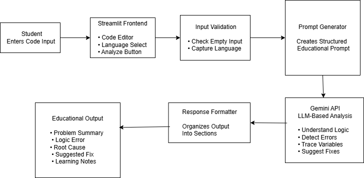

# LogicTrace AI 💻

An AI-powered educational debugging assistant designed to help beginner programmers identify, visualize, and understand hidden logical errors in their code .
Traditional compilers and IDEs excel at catching syntax issues but leave students completely stranded when code runs but produces incorrect results . LogicTrace AI bridges this gap by using a Large Language Model to serve as a virtual programming tutor that prioritizes conceptual learning over lazy copy-pasting .

## 🔗 Live Demo
👉 [Launch LogicTrace AI Web App](https://logictrace-ai-t6nuwkofi69hadgwmadn8m.streamlit.app/)


## 💡 Features

* **Intent-Driven Debugging:** Compares faulty code directly against the user's explicit *Expected Behavior* statement to target the true algorithmic goal .
* **Socratic Feedback:** Intentionally constrains output to educational guidance, ensuring students learn the core computer science concepts instead of just copy-pasting generic fixes .
* **Variable Trace Simulation:** Simulates execution states over code blocks to explicitly illustrate how data values change incorrectly across cycles .
* **Structured Markdown Reporting:** Breaks down the analysis into strict, digestible pillars :
  1. 🔍 1. Where the Logic Broke (Problem & Error Identification) 
  2. 📊 2. What the Variables Are Doing (Variable Trace Simulation) 
  3. 🛠️ 3. How to Fix It (Suggested Guidance & Core Learning Explanations) 


## 🛠️ Tech Stack

* **Presentation Layer:** Streamlit (Python-native rapid UI generation framework) 
* **AI Orchestration Framework:** Google GenAI SDK (`google-generativeai` module) 
* **Core Model Engine:** `gemini-2.5-flash` (Optimized for speed, low latency, and structured formatting compliance) 
* **Deployment Target:** Streamlit Community Cloud 

---

## 🧠 Architecture

Below is the design layout and systemic data flow of the application tracking input ingestion through to response formatting :



### Core System Design Trade-offs 

#### 1. LLM Inference vs. Static AST Tracking 
* **Decision:** Leveraged an LLM via the Gemini API rather than writing programmatic AST analyzers or deterministic rule-based compilers .
* **Reasoning:** AST parsers evaluate syntax structure but cannot comprehend a developer's underlying intent . If a beginner types `<` instead of `<=`, an AST parser sees perfectly valid code; Gemini flags the logical discrepancy against the user's declared objective .

#### 2. Streamlit Web UI vs. Full-Stack JavaScript (React/Node.js) 
* **Decision:** Deployed on Streamlit for accelerated web prototyping .
* **Reasoning:** In a short-window hackathon challenge, development speed and functional robustness are critical . Streamlit eliminates complex state-management boilerplate, allowing 100% of the engineering focus to be spent on robust prompt pipelines and secure backend validation .

---

## ⚙️ Setup & Local Installation 

### Prerequisites
Make sure you have Python 3.9+ installed on your computer.

### 1. Install Dependencies
Install the required software packages using your terminal:
```bash
pip install -r requirements.txt
